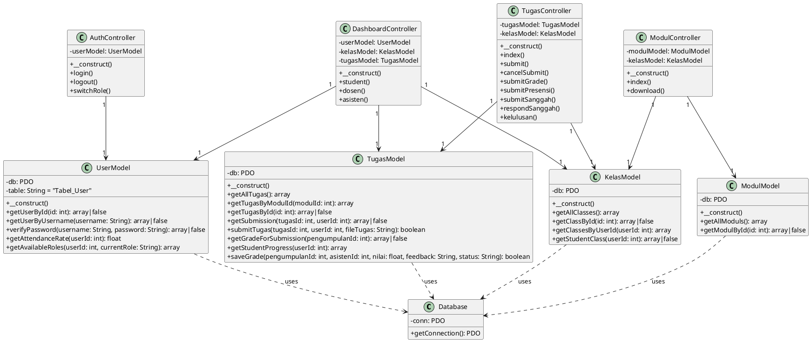
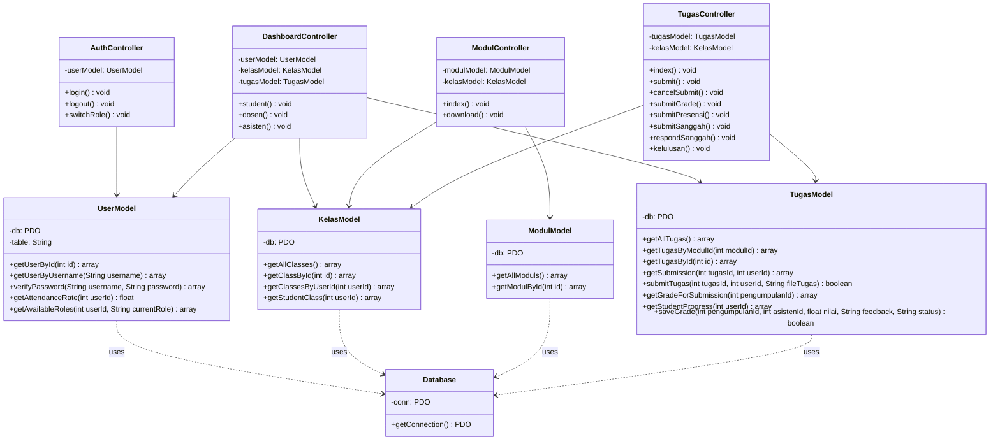

# Prompt & Kode UML Class Diagram (EduLab UHO)

Dokumen ini berisi deskripsi instruksi (prompt) dan kode diagram UML (PlantUML & Mermaid) yang merepresentasikan seluruh arsitektur class di backend **EduLab UHO**. Anda dapat langsung menyalin kode di bawah ini dan mengimpornya ke **Visual Paradigm** (melalui fitur *Import PlantUML*) atau generator diagram AI lainnya.

---

## 1. Prompt untuk AI Diagram Generator (Visual Paradigm / Chat/DLL)
> "Buatlah sebuah UML Class Diagram untuk aplikasi web berbasis PHP MVC Native bernama **EduLab UHO** (Platform Praktikum & Penilaian). Diagram harus mencakup kelas koneksi database, kelas model, dan kelas controller dengan relasi Dependency atau Association yang tepat. Gunakan format standar UML (atribut diawali `-` untuk private, `+` untuk public, tipe data dipisahkan dengan titik dua `:`):
> 
> **Kelas-Kelas yang Harus Ada:**
> 1. `Database` (Helper)
> 2. **Model:** `UserModel`, `KelasModel`, `ModulModel`, `TugasModel`
> 3. **Controller:** `AuthController`, `DashboardController`, `ModulController`, `TugasController`
> 
> **Atribut dan Method masing-masing kelas:**
> (Cantumkan seluruh method dan tipe data seperti yang tertulis dalam kode PlantUML di bawah)."

---

## 2. Kode PlantUML (Direkomendasikan untuk Visual Paradigm)
*Salin kode di bawah ini, lalu di Visual Paradigm pilih: **File > Import > PlantUML...***

---

## 3. Kode Mermaid.js (Untuk Preview Markdown / Github / AI)

